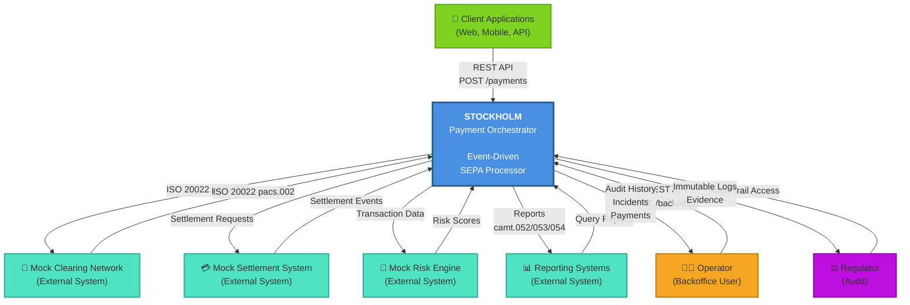

# Context Diagram

## System Context

Shows Stockholm and its external stakeholders/systems.



## Context Description

### Internal System: Stockholm

**Core Responsibility**: Orchestrate SEPA Instant Credit Transfers with event-driven architecture and AI-assisted transaction monitoring.

**Key Capabilities**:
- Accept payment requests via REST API
- Generate ISO 20022 messages (pacs.008)
- Communicate with clearing/settlement systems
- Analyze transactions for anomalies
- Generate regulatory reports
- Maintain immutable audit trails
- Support backoffice operations

### External Systems

| System | Role | Protocol | Example Data |
|--------|------|----------|--------------|
| **Mock Clearing Network** | Simulates SEPA clearing | ISO 20022 (pacs.008/002) | Payment initiation, status responses |
| **Mock Settlement System** | Simulates fund settlement | JSON Events | Settlement completion/failure |
| **Mock Risk Engine** | Simulates AI/ML anomaly detection | JSON Events | Risk scores, alert reasons |
| **Reporting Systems** | Simulates regulatory reporting | ISO 20022 (camt.052/053/054) | Balance reports, transaction statements |

### User Roles

| Role | Interaction | Access Type |
|------|-------------|------------|
| **Client Application** | Submits payments, checks status | REST API (Public) |
| **Operator** | Monitors incidents, replays messages | Backoffice API (Internal) |
| **Regulator** | Reviews audit evidence | Read-Only API (Restricted) |

---

## Interface Specifications

### Client-Facing Interface

```http
POST /api/v1/payments
Content-Type: application/json

{
  "orderer": "AcctID123",
  "beneficiary": "AcctID456",
  "amount": 1000.00,
  "currency": "EUR"
}

Response: 201 Created
{
  "paymentId": "PAY-abc123",
  "status": "initiated",
  "correlationId": "uuid-xxx"
}
```

### Backoffice Interface

```http
GET /backoffice/api/v1/payments?status=failed
GET /backoffice/api/v1/incidents
GET /backoffice/api/v1/payments/{id}/audit-trail
POST /backoffice/api/v1/replay/dlq
```

### Regulatory Interface

```http
GET /regulatory/api/v1/audit-events?from=2024-01-01&to=2024-01-31
GET /regulatory/api/v1/incident-evidence
```

---

## Data Flows

### Successful Payment Flow

```
Client → Stockholm: Payment Request
Stockholm → Mock Clearing: ISO 20022 pacs.008
Mock Clearing → Stockholm: pacs.002 Status
Stockholm → Mock Settlement: Settlement Request
Mock Settlement → Stockholm: Settlement Complete
Stockholm → Mock Risk Engine: Transaction Analysis
Mock Risk Engine → Stockholm: Risk Score
Stockholm → Reporting: Report Generation
Stockholm → Client: Payment Status
```

### Anomaly Detection Flow

```
Stockholm → Mock Risk Engine: High-Risk Transaction
Mock Risk Engine → Stockholm: Anomaly Alert
Stockholm → Operator: Create Incident
Operator → Stockholm: Manual Review
Stockholm → Regulator: Audit Evidence
```

---

## Related Documentation

- **Arc42 Section 3**: System Scope and Context
- **ADR-002**: Event-Driven Architecture
- **ADR-003**: Kafka as Event Backbone
- **Container Diagram**: See [02-container-diagram.md](02-container-diagram.md)

---

**Last Updated**: June 26, 2026

