# Container Diagram

## System Architecture Overview

Shows the major containers (microservices, databases, message brokers) and their interactions.

```mermaid
graph TB
    Client["👤 Client<br/>Web/Mobile/API"]

    subgraph Stockholm["🏛️ STOCKHOLM PLATFORM"]
        direction TB

        Gateway["🚪 REST API Gateway<br/>Authentication<br/>Rate Limiting"]

        Orchestrator["⚙️ Payment Orchestrator<br/>Service<br/><br/>✓ Validate requests<br/>✓ Generate pacs.008<br/>✓ Track payment status<br/>✓ Publish events"]

        Settlement["💰 Settlement Service<br/><br/>✓ Simulate clearing<br/>✓ Generate pacs.002<br/>✓ Publish settlement events"]

        Ledger["📝 Ledger Service<br/><br/>✓ Update balances<br/>✓ Record transactions<br/>✓ Audit events"]

        Reporting["📊 Reporting Service<br/><br/>✓ Generate camt.052<br/>✓ Generate camt.053<br/>✓ Generate camt.054"]

        Anomaly["🤖 Anomaly Detection<br/>Service<br/><br/>✓ Calculate risk score<br/>✓ Explain factors<br/>✓ Raise alerts"]

        Monitor["🔍 Resilience Monitor<br/><br/>✓ Health checks<br/>✓ Incident tracking<br/>✓ Event replay<br/>✓ DLQ management"]

        Backoffice["🔧 Backoffice API<br/><br/>✓ Search payments<br/>✓ View incidents<br/>✓ Audit history<br/>✓ Manual replay"]
    end

    subgraph Messaging["📨 Event Backbone"]
        direction TB
        Kafka["Apache Kafka<br/>Topics:<br/>payment.initiated<br/>settlement.completed<br/>anomaly.detected<br/>...etc"]
    end

    subgraph Data["💾 Data Layer"]
        direction TB
        Postgres["PostgreSQL<br/><br/>Tables:<br/>✓ payments<br/>✓ audit_events<br/>✓ incidents<br/>✓ ledger_entries"]
        Redis["Redis Cache<br/><br/>✓ Session data<br/>✓ Correlation IDs<br/>✓ Rate limit counters"]
    end

    subgraph External["🌐 External Systems"]
        direction TB
        Clearing["Mock Clearing<br/>Network"]
        Settlement_Ext["Mock Settlement<br/>System"]
        Risk["Mock Risk<br/>Engine"]
        Reports["Reporting<br/>Systems"]
    end

    subgraph Monitoring["📈 Observability Stack"]
        direction TB
        Prometheus["Prometheus<br/>Metrics"]
        Grafana["Grafana<br/>Dashboards"]
        Loki["Loki<br/>Logs"]
        Tempo["Tempo<br/>Traces"]
    end

    Client -->|REST| Gateway

    Gateway -->|Routes| Orchestrator
    Gateway -->|Routes| Backoffice

    Orchestrator -->|Produces<br/>Consumes| Kafka
    Settlement -->|Produces<br/>Consumes| Kafka
    Ledger -->|Produces<br/>Consumes| Kafka
    Reporting -->|Produces<br/>Consumes| Kafka
    Anomaly -->|Produces<br/>Consumes| Kafka
    Monitor -->|Produces<br/>Consumes| Kafka

    Orchestrator -->|Read/Write| Postgres
    Ledger -->|Read/Write| Postgres
    Anomaly -->|Read| Postgres
    Monitor -->|Read/Write| Postgres
    Backoffice -->|Read| Postgres

    Orchestrator -->|Cache| Redis
    Settlement -->|Cache| Redis
    Anomaly -->|Cache| Redis

    Orchestrator -->|ISO 20022| Clearing
    Clearing -->|ISO 20022| Orchestrator

    Settlement -->|Events| Settlement_Ext
    Settlement_Ext -->|Events| Settlement

    Anomaly -->|Transactions| Risk
    Risk -->|Scores| Anomaly

    Reporting -->|Reports| Reports

    Monitor -->|Scrapes| Prometheus
    Prometheus -->|Queries| Grafana

    Orchestrator -->|Metrics| Prometheus
    Settlement -->|Metrics| Prometheus
    Ledger -->|Metrics| Prometheus
    Anomaly -->|Metrics| Prometheus
    Monitor -->|Metrics| Prometheus

    Gateway -->|Logs| Loki
    Orchestrator -->|Traces| Tempo
    Settlement -->|Traces| Tempo
    Ledger -->|Traces| Tempo
    Anomaly -->|Traces| Tempo

    style Gateway fill:#FFB700,stroke:#B27F1B,stroke-width:2px
    style Orchestrator fill:#4A90E2,stroke:#2E5C8A,stroke-width:2px
    style Settlement fill:#7ED321,stroke:#5FA015,stroke-width:2px
    style Ledger fill:#7ED321,stroke:#5FA015,stroke-width:2px
    style Reporting fill:#7ED321,stroke:#5FA015,stroke-width:2px
    style Anomaly fill:#F5A623,stroke:#B27F1B,stroke-width:2px
    style Monitor fill:#F5A623,stroke:#B27F1B,stroke-width:2px
    style Backoffice fill:#50E3C2,stroke:#2FA8A4,stroke-width:2px
    style Kafka fill:#000,stroke:#666,stroke-width:2px,color:#fff
    style Postgres fill:#336791,stroke:#1a3a4d,stroke-width:2px,color:#fff
    style Redis fill:#DC382D,stroke:#8B1A1A,stroke-width:2px,color:#fff
    style Prometheus fill:#E6522C,stroke:#A03D1F,stroke-width:2px,color:#fff
    style Grafana fill:#F47D20,stroke:#B25514,stroke-width:2px,color:#fff
```



## Component Responsibilities

### Core Services

| Service | Responsibilities | Dependencies |
|---------|-----------------|--------------|
| **Payment Orchestrator** | Payment initiation, ISO 20022 generation, status tracking | Kafka, PostgreSQL, Redis |
| **Settlement Service** | Mock clearing simulation, pacs.002 generation | Kafka, PostgreSQL, Mock Clearing |
| **Ledger Service** | Balance management, transaction recording | Kafka, PostgreSQL |
| **Reporting Service** | CAMT report generation (052/053/054) | Kafka, PostgreSQL |
| **Anomaly Detection** | Risk scoring, anomaly flagging | Kafka, PostgreSQL, Mock Risk Engine |
| **Resilience Monitor** | Health checks, incident management, DLQ replay | Kafka, PostgreSQL |
| **Backoffice API** | Operational queries, manual interventions | PostgreSQL |

### Infrastructure Components

| Component | Role | Technology |
|-----------|------|-----------|
| **REST API Gateway** | Request routing, auth, rate limiting | Spring Cloud Gateway / Spring Security |
| **Kafka** | Event backbone, decoupling | Apache Kafka |
| **PostgreSQL** | Persistent state, audit trail | PostgreSQL 16+ |
| **Redis** | Caching, correlation ID tracking | Redis 7+ |

### Observability Stack

| Component | Purpose | Technology |
|-----------|---------|-----------|
| **Prometheus** | Metrics collection | Prometheus |
| **Grafana** | Metrics visualization | Grafana |
| **Loki** | Log aggregation | Loki |
| **Tempo** | Distributed tracing | Tempo/Jaeger |

---

## Technology Stack per Component

```
Payment Orchestrator
├─ Language: Java 21
├─ Framework: Spring Boot 3.2+
├─ REST: Spring Web
├─ Messaging: Spring Kafka
├─ Database: Spring Data JPA
└─ ORM: Hibernate

Settlement Service
├─ Language: Java 21
├─ Framework: Spring Boot 3.2+
├─ Messaging: Spring Kafka
├─ ISO 20022: Custom library
└─ Database: Spring Data JPA

Ledger Service
├─ Language: Java 21
├─ Framework: Spring Boot 3.2+
├─ Messaging: Spring Kafka
├─ Transactions: Spring @Transactional
└─ Database: Spring Data JPA

Reporting Service
├─ Language: Java 21
├─ Framework: Spring Boot 3.2+
├─ Messaging: Spring Kafka
├─ Reports: ISO 20022 generation
└─ Database: Spring Data JPA

Anomaly Detection
├─ Language: Java 21
├─ Framework: Spring Boot 3.2+
├─ Scoring: Rule-based engine
├─ Messaging: Spring Kafka
└─ Database: Spring Data JPA

Resilience Monitor
├─ Language: Java 21
├─ Framework: Spring Boot 3.2+
├─ Health: Spring Boot Actuator
├─ Messaging: Spring Kafka
└─ Database: Spring Data JPA

Backoffice API
├─ Language: Java 21
├─ Framework: Spring Boot 3.2+
├─ Security: Spring Security + JWT
├─ Query: Spring Data JPA
└─ Database: Spring Data PostgreSQL
```

---

## Communication Patterns

### Synchronous (HTTP/REST)

```
Client → API Gateway → Orchestrator
Backoffice → Backoffice API → PostgreSQL
```

### Asynchronous (Kafka Events)

```
Orchestrator ──publish──> Kafka
                            ↓
        ┌───────────────────┼───────────────────┐
        ↓                   ↓                   ↓
    Settlement          Ledger             Anomaly
    (consume)           (consume)           (consume)
        ↓                   ↓                   ↓
    ──publish──────────publish──────────publish──>
```

---

## Data Storage Strategy

### PostgreSQL Tables

- `payments` - Payment records and status
- `audit_events` - Immutable audit log
- `incidents` - Operational incidents
- `ledger_entries` - All balance changes
- `anomaly_alerts` - Detected anomalies

### Redis Keys

- `correlation:{id}` - Request context
- `idempotency:{key}` - Idempotent checks
- `rate_limit:{user}` - Rate limiting counters

### Kafka Topics

- `payment.initiated` - New payment request
- `payment.validated` - Validation complete
- `settlement.completed` - Settlement success
- `settlement.failed` - Settlement failure
- `ledger.updated` - Balance update
- `anomaly.detected` - Anomaly alert
- `incident.created` - Incident created
- `reporting.generated` - Report generated

---

## Deployment Units

Each service is independently deployable:

- Payment Orchestrator Service
- Settlement Service
- Ledger Service
- Reporting Service
- Anomaly Detection Service
- Resilience Monitor Service
- Backoffice API Service

All communicate via:
- **Kafka** for event-driven async
- **PostgreSQL** for shared data layer
- **Redis** for cross-service caching

---

## Related Documentation

- **Arc42 Section 5**: Building Block View (Container Level)
- **ADR-002**: Event-Driven Architecture
- **ADR-003**: Kafka as Event Backbone
- **ADR-004**: PostgreSQL for Ledger
- **Sequence Diagrams**: See [03-sequence-diagrams.md](03-sequence-diagrams.md)
- **Deployment Diagram**: See [04-deployment-diagram.md](04-deployment-diagram.md)

---

**Last Updated**: June 26, 2026

