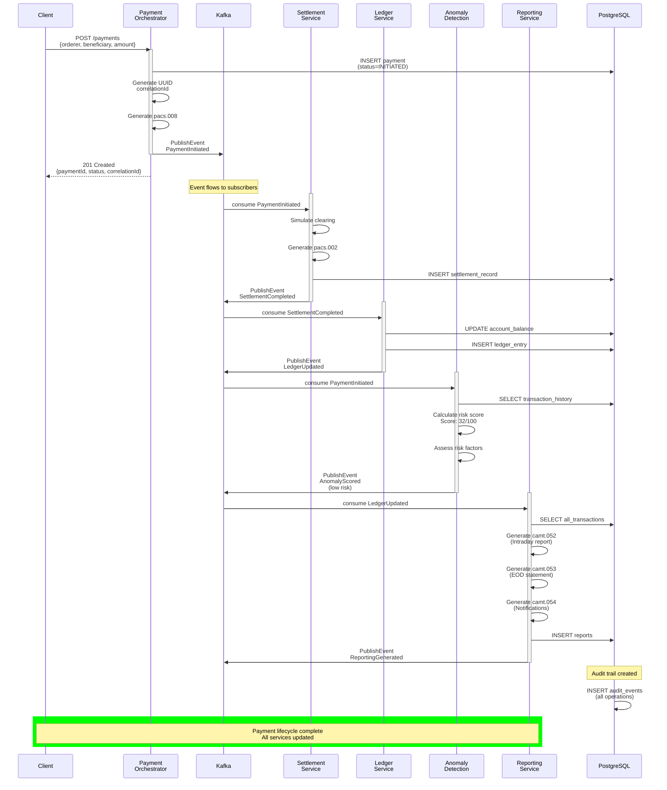
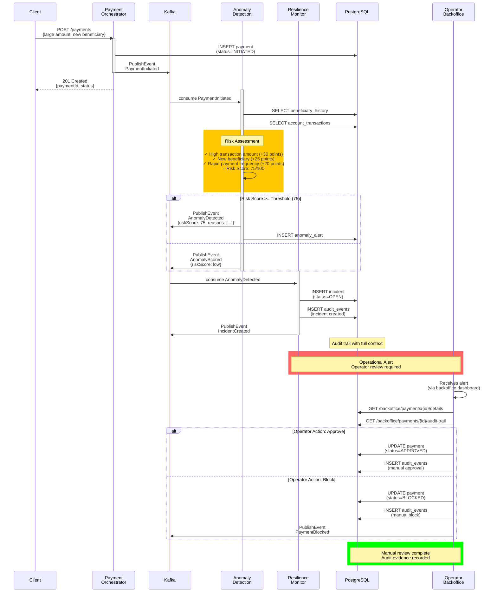
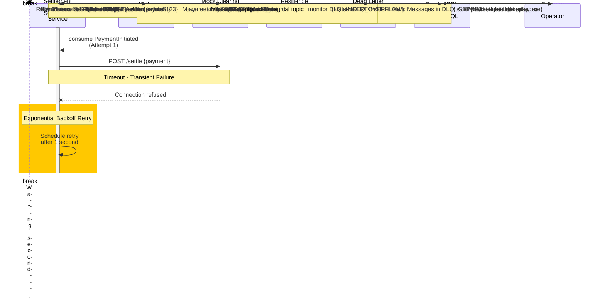
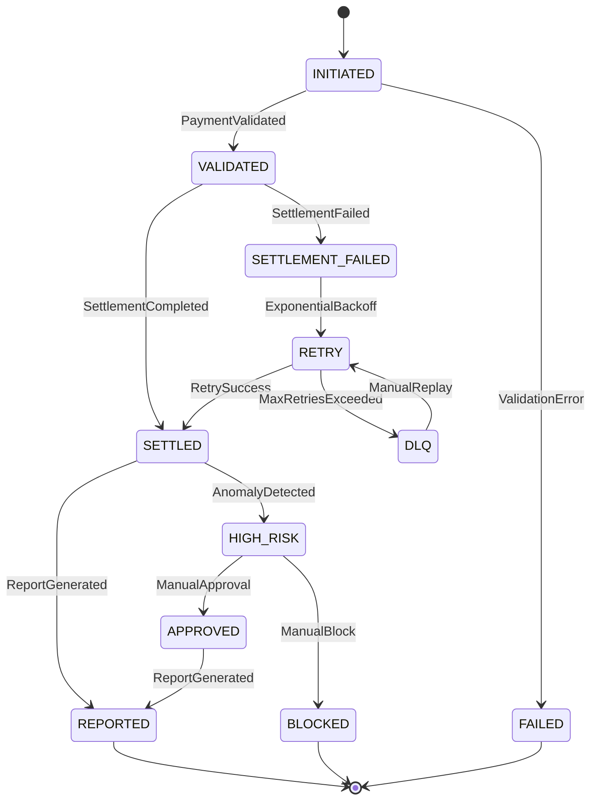
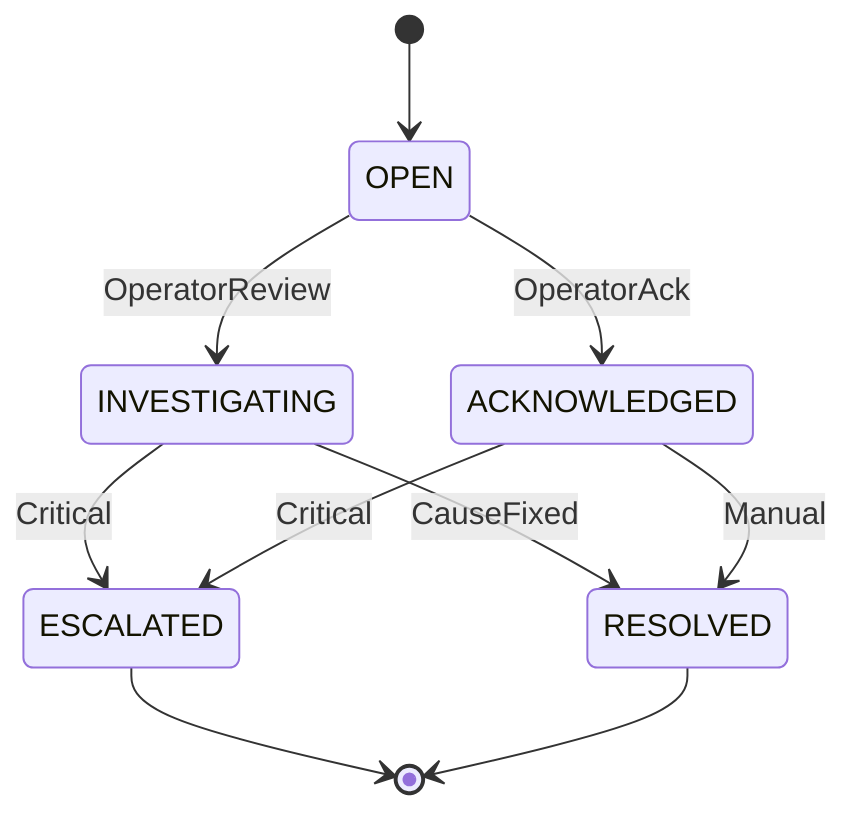

# Sequence Diagrams

## Scenario 1: Successful Payment Flow

Shows the complete lifecycle of a successful payment from initiation through reporting.



**Timeline**: ~500ms total (async processing)

**Key Points**:
- ✅ Correlation ID propagated through all events
- ✅ Each service processes independently
- ✅ Audit trail created for every operation
- ✅ Risk score calculated but payment proceeds (low risk)
- ✅ Reports generated from updated ledger
- ✅ Core chain is explicit: `payment.initiated → settlement.completed → ledger.updated → reporting-service`

---

## Scenario 2: High-Risk Transaction Detection

Shows the flow when anomaly detection flags a suspicious transaction.



**Key Points**:
- ✅ Anomaly detected by rule-based scoring
- ✅ Incident created automatically
- ✅ Operator alerted for manual review
- ✅ All actions audited with correlation ID
- ✅ Multiple risk factors documented
- ✅ Payment can proceed or be blocked based on review

---

## Scenario 3: Settlement Failure with Retry and Recovery

Shows how the system handles transient failures and implements recovery.



**Timeline**:
- Success path: ~1.5-4 seconds (with retries)
- Failure path: Minutes (manual intervention)

**Key Points**:
- ✅ Automatic retry with exponential backoff (1s, 2s, 4s, 8s, 16s)
- ✅ Transient failures handled gracefully
- ✅ Messages survive service restarts
- ✅ Permanent failures moved to DLQ
- ✅ Operator can replay from DLQ
- ✅ All retry attempts audited
- ✅ Correlation ID maintained throughout

---

## Event State Transitions

### Payment Lifecycle States



### Incident Lifecycle States



---

## Correlation ID Flow Example

All related events share the same correlation ID:

```
Payment Request
  ↓ (UUID generated: 550e8400-e29b-41d4-a716-446655440000)
  ├─ audit_events.correlation_id = 550e8400...
  ├─ payment.initiated event header
  ├─ payment record
  └─ All downstream operations inherit same ID
      ├─ Settlement event
      ├─ Ledger event
      ├─ Anomaly event
      ├─ Reporting event
      └─ All audit entries linked

Query: SELECT * FROM audit_events
       WHERE correlation_id = '550e8400...'
Result: Complete transaction timeline
```

---

## Related Documentation

- **Arc42 Section 6**: Runtime View
- **ADR-006**: Immutable Audit Trail
- **ADR-007**: Correlation ID Strategy
- **ADR-008**: Retry and Dead Letter Queue
- **Container Diagram**: See [02-container-diagram.md](02-container-diagram.md)
- **Deployment Diagram**: See [04-deployment-diagram.md](04-deployment-diagram.md)

---

**Last Updated**: June 26, 2026

