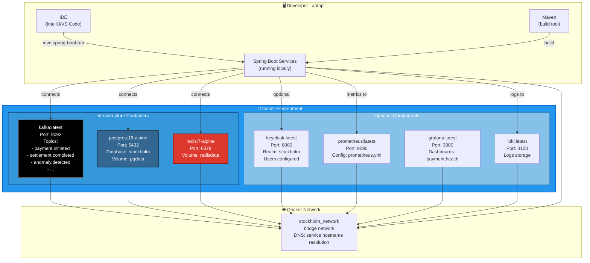
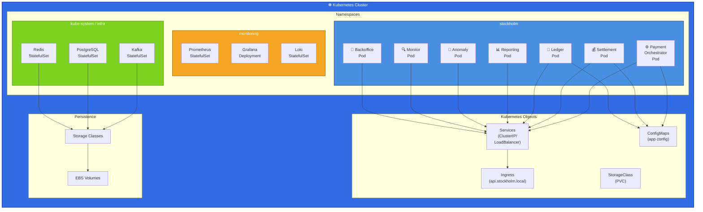

# Deployment Diagram

## Local Development (Docker Compose)

Shows the complete local development environment.



### docker-compose.yml Structure

```yaml
version: '3.8'

services:
  # Required Infrastructure
  kafka:
    image: confluentinc/cp-kafka:7.5.0
    environment:
      KAFKA_BROKER_ID: 1
      KAFKA_ADVERTISED_LISTENERS: PLAINTEXT://kafka:9092
      # ... more config
    ports:
      - "9092:9092"
    volumes:
      - kafka-data:/var/lib/kafka/data
    healthcheck:
      test: ["CMD", "kafka-broker-api-versions", "--bootstrap-server", "localhost:9092"]
      interval: 10s
      timeout: 5s
      retries: 5

  postgres:
    image: postgres:16-alpine
    environment:
      POSTGRES_DB: stockholm
      POSTGRES_PASSWORD: password
    ports:
      - "5432:5432"
    volumes:
      - postgres-data:/var/lib/postgresql/data
      - ./init-db.sql:/docker-entrypoint-initdb.d/init.sql
    healthcheck:
      test: ["CMD-SHELL", "pg_isready -U postgres"]
      interval: 10s
      timeout: 5s
      retries: 5

  redis:
    image: redis:7-alpine
    ports:
      - "6379:6379"
    volumes:
      - redis-data:/data
    healthcheck:
      test: ["CMD", "redis-cli", "ping"]
      interval: 10s
      timeout: 5s
      retries: 5

  # Optional: Identity & Access Management
  keycloak:
    image: quay.io/keycloak/keycloak:23.0.0
    environment:
      KEYCLOAK_ADMIN: admin
      KEYCLOAK_ADMIN_PASSWORD: admin
    ports:
      - "8080:8080"
    command:
      - start-dev
    depends_on:
      postgres:
        condition: service_healthy

  # Optional: Monitoring
  prometheus:
    image: prom/prometheus:latest
    ports:
      - "9090:9090"
    volumes:
      - ./monitoring/prometheus.yml:/etc/prometheus/prometheus.yml
      - prometheus-data:/prometheus
    command:
      - "--config.file=/etc/prometheus/prometheus.yml"

  grafana:
    image: grafana/grafana:latest
    ports:
      - "3000:3000"
    environment:
      GF_SECURITY_ADMIN_PASSWORD: admin
    volumes:
      - grafana-data:/var/lib/grafana
      - ./monitoring/dashboards:/etc/grafana/provisioning/dashboards
    depends_on:
      - prometheus

  loki:
    image: grafana/loki:latest
    ports:
      - "3100:3100"
    volumes:
      - loki-data:/loki

volumes:
  postgres-data:
  redis-data:
  kafka-data:
  prometheus-data:
  grafana-data:
  loki-data:

networks:
  default:
    name: stockholm_network
```

### Startup Commands

```bash
# Start all infrastructure
docker-compose up -d

# Start with specific services (minimal)
docker-compose up -d kafka postgres redis

# View logs
docker-compose logs -f kafka

# Stop everything
docker-compose down

# Clean up (delete volumes)
docker-compose down -v

# Run single service
docker-compose run --rm postgres psql -U postgres
```

---

## Production Deployment (Docker Containers)

Shows containerized deployment for production.

```mermaid
graph TB
    subgraph Docker["🐳 Container Registry"]
        direction TB
        OrchImage["payment-orchestrator:1.0.0<br/>Java 21 + Spring Boot"]
        SettlementImage["settlement-service:1.0.0<br/>Java 21 + Spring Boot"]
        LedgerImage["ledger-service:1.0.0<br/>Java 21 + Spring Boot"]
        ReportingImage["reporting-service:1.0.0<br/>Java 21 + Spring Boot"]
        AnomalyImage["anomaly-service:1.0.0<br/>Java 21 + Spring Boot"]
        MonitorImage["resilience-monitor:1.0.0<br/>Java 21 + Spring Boot"]
        BackofficeImage["backoffice-api:1.0.0<br/>Java 21 + Spring Boot"]
    end

    subgraph OrchestrationLayer["🎼 Container Orchestration"]
        direction TB
        DockerSwarm["Docker Swarm<br/>OR<br/>Kubernetes Cluster"]
    end

    subgraph Runtime["▶️ Running Containers"]
        direction TB

        subgraph PaymentStack["Payment Services"]
            OrchContainer1["orchestrator-1<br/>Port: 8081"]
            OrchContainer2["orchestrator-2<br/>Port: 8082"]
            OrchContainer3["orchestrator-3<br/>Port: 8083"]
            LoadBalancer["🔄 Load Balancer<br/>:8080"]
        end

        subgraph Services["Service Containers"]
            SettlementCont["settlement-1<br/>:8084"]
            LedgerCont["ledger-1<br/>:8085"]
            ReportingCont["reporting-1<br/>:8086"]
            AnomalyCont["anomaly-1<br/>:8087"]
            MonitorCont["monitor-1<br/>:8088"]
            BackofficeCont["backoffice-1<br/>:8089"]
        end

        subgraph InfraServices["Infrastructure Services"]
            KafkaNode["kafka-1<br/>kafka-2<br/>kafka-3<br/>Cluster"]
            PostgresPrimary["postgres-primary<br/>Port: 5432"]
            PostgresReplica["postgres-replica<br/>Standby"]
            RedisNode["redis-1<br/>redis-2<br/>redis-3<br/>Cluster"]
        end
    end

    subgraph Storage["💾 Persistent Storage"]
        direction TB
        PGVolume["PostgreSQL Volumes<br/>Replication enabled<br/>Backups"]
        KafkaVolume["Kafka Topics<br/>Retention: 7 days<br/>Replication: 3"]
        RedisVolume["Redis AOF<br/>RDB snapshots"]
    end

    subgraph Monitoring["📊 Observability"]
        direction TB
        PrometheusCluster["Prometheus Cluster<br/>High Availability"]
        GrafanaDeploy["Grafana<br/>Multiple replicas"]
        LokiCluster["Loki Cluster<br/>Log aggregation"]
        TempoCluster["Tempo<br/>Trace storage"]
    end

    subgraph Networking["🌐 Networking"]
        direction TB
        ServiceMesh["Service Mesh<br/>(Istio optional)<br/>mTLS<br/>Circuit Breaking<br/>Canary Deployments"]
    end

    OrchImage --> DockerSwarm
    SettlementImage --> DockerSwarm
    LedgerImage --> DockerSwarm
    ReportingImage --> DockerSwarm
    AnomalyImage --> DockerSwarm
    MonitorImage --> DockerSwarm
    BackofficeImage --> DockerSwarm

    DockerSwarm -->|deploy| OrchContainer1
    DockerSwarm -->|deploy| OrchContainer2
    DockerSwarm -->|deploy| OrchContainer3
    DockerSwarm -->|deploy| SettlementCont
    DockerSwarm -->|deploy| LedgerCont
    DockerSwarm -->|deploy| ReportingCont
    DockerSwarm -->|deploy| AnomalyCont
    DockerSwarm -->|deploy| MonitorCont
    DockerSwarm -->|deploy| BackofficeCont

    LoadBalancer --> OrchContainer1
    LoadBalancer --> OrchContainer2
    LoadBalancer --> OrchContainer3

    OrchContainer1 --> KafkaNode
    SettlementCont --> KafkaNode
    LedgerCont --> KafkaNode
    ReportingCont --> KafkaNode
    AnomalyCont --> KafkaNode
    MonitorCont --> KafkaNode

    OrchContainer1 --> PostgresPrimary
    LedgerCont --> PostgresPrimary
    AnomalyCont --> PostgresPrimary
    MonitorCont --> PostgresPrimary
    BackofficeCont --> PostgresPrimary

    PostgresPrimary --> PostgresReplica

    OrchContainer1 --> RedisNode
    SettlementCont --> RedisNode
    AnomalyCont --> RedisNode

    KafkaNode --> KafkaVolume
    PostgresPrimary --> PGVolume
    PostgresReplica --> PGVolume
    RedisNode --> RedisVolume

    OrchContainer1 --> PrometheusCluster
    SettlementCont --> PrometheusCluster
    LedgerCont --> PrometheusCluster
    ReportingCont --> PrometheusCluster
    AnomalyCont --> PrometheusCluster
    MonitorCont --> PrometheusCluster

    PrometheusCluster --> GrafanaDeploy

    OrchContainer1 -.->|logs| LokiCluster
    SettlementCont -.->|logs| LokiCluster
    LedgerCont -.->|logs| LokiCluster
    ReportingCont -.->|logs| LokiCluster
    AnomalyCont -.->|logs| LokiCluster
    MonitorCont -.->|logs| LokiCluster

    OrchContainer1 -.->|traces| TempoCluster
    SettlementCont -.->|traces| TempoCluster

    Services --> ServiceMesh
    style Docker fill:#2496ED,stroke:#0066CC,stroke-width:2px,color:#fff
    style Runtime fill:#27AE60,stroke:#1E8449,stroke-width:2px,color:#fff
    style Storage fill:#E67E22,stroke:#A04000,stroke-width:2px,color:#fff
    style Monitoring fill:#8E44AD,stroke:#5B2C6F,stroke-width:2px,color:#fff
    style Networking fill:#C0392B,stroke:#7B241C,stroke-width:2px,color:#fff
```



### Horizontal Scaling

```
Payment Orchestrator (Scale=3):
  Instance 1: 2 CPU, 4GB RAM, 2 replicas
  Instance 2: 2 CPU, 4GB RAM, 2 replicas
  Instance 3: 2 CPU, 4GB RAM, 2 replicas
  Total: 6 CPU, 12GB RAM, 6 concurrent requests

Settlement Service (Scale=2):
  Instance 1: 1 CPU, 2GB RAM
  Instance 2: 1 CPU, 2GB RAM

Ledger Service (Scale=2):
  Instance 1: 1 CPU, 2GB RAM
  Instance 2: 1 CPU, 2GB RAM

Infrastructure:
  Kafka: 3 brokers, topic replication factor=3
  PostgreSQL: Primary + 1 Standby Replica
  Redis: 3 nodes, cluster mode enabled
```

---

## Kubernetes Deployment

Shows Kubernetes manifest structure.



### Key Kubernetes Manifests

```yaml
# payment-orchestrator-deployment.yaml
apiVersion: apps/v1
kind: Deployment
metadata:
  name: payment-orchestrator
  namespace: stockholm
spec:
  replicas: 3
  selector:
    matchLabels:
      app: payment-orchestrator
  template:
    metadata:
      labels:
        app: payment-orchestrator
    spec:
      containers:
      - name: orchestrator
        image: registry.example.com/stockholm/payment-orchestrator:1.0.0
        ports:
        - containerPort: 8080
        env:
        - name: KAFKA_BOOTSTRAP_SERVERS
          valueFrom:
            configMapKeyRef:
              name: stockholm-config
              key: kafka.servers
        - name: DATABASE_URL
          valueFrom:
            secretKeyRef:
              name: db-credentials
              key: url
        resources:
          requests:
            cpu: "500m"
            memory: "1Gi"
          limits:
            cpu: "1000m"
            memory: "2Gi"
        livenessProbe:
          httpGet:
            path: /actuator/health
            port: 8080
          initialDelaySeconds: 30
          periodSeconds: 10
        readinessProbe:
          httpGet:
            path: /actuator/health/readiness
            port: 8080
          initialDelaySeconds: 10
          periodSeconds: 5
---
apiVersion: v1
kind: Service
metadata:
  name: payment-orchestrator
  namespace: stockholm
spec:
  type: ClusterIP
  ports:
  - port: 8080
    targetPort: 8080
  selector:
    app: payment-orchestrator
```

---

## High Availability Configuration

### Multi-Region Setup

```
Primary Region (EU-West):
├── Kubernetes Cluster 1 (3 master, 6 worker nodes)
├── PostgreSQL Primary + 1 Standby
├── Kafka Cluster (3 brokers)
└── Redis Cluster (3 nodes)

Secondary Region (EU-Central) - DR:
├── Kubernetes Cluster 2 (1 master, 2 worker nodes)
├── PostgreSQL Standby (read-only)
├── Kafka Cluster (1 broker - replication)
└── Redis (read-replica)

Active-Active Load Balancing:
- Global Load Balancer routes to nearest region
- Database replication: Primary → Secondary
- Kafka replication: cross-region topics
- Failover: Automatic if primary unhealthy
```

### Disaster Recovery

```
RTO (Recovery Time Objective): 15 minutes
RPO (Recovery Point Objective): 1 minute

Backup Strategy:
- PostgreSQL: Continuous WAL archiving + daily snapshots
- Kafka: Topic replication (RF=3)
- Configurations: GitOps (stored in Git)
- Secrets: Vault encrypted, backed up

Restore Procedure:
1. Failover DNS to secondary region
2. Promote secondary PostgreSQL to primary
3. Kafka consumers reset to backed-up offset
4. Health checks verify all services
5. Alert operations team for verification
```

---

## Related Documentation

- **Arc42 Section 7**: Deployment View
- **ADR-009**: Docker-Based Local Deployment
- **Container Diagram**: See [02-container-diagram.md](02-container-diagram.md)
- **README.md Running Locally**: Link to setup instructions

---

**Last Updated**: June 26, 2026

